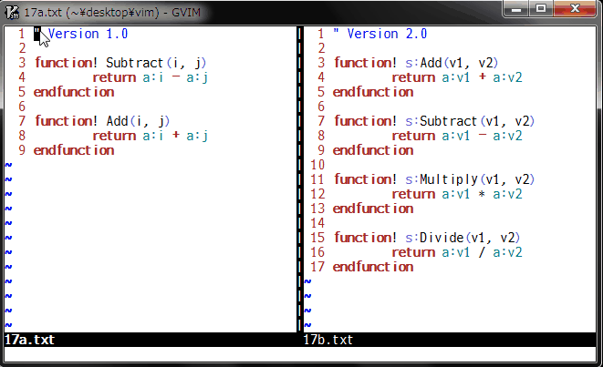

# spotdiff.vim

## A range selectable diffthis to compare partially

### Introduction

This plugin has been developed in order to make diff mode more useful.
Vim always shows a diff for whole lines of a window. But this plugin allows
to specify the range and then partially make a spot diff.

This plugin provides `:Diffthis`, `:Diffoff` and `:Diffupdate` commands, which
are alternative to vim original `:diffthis`, `:diffoff` and `:diffupdate`.

You can use `:Diffthis` to select a block of lines and to make the current
window diff mode. The selected lines are all indicated with `hl-CursorLine`
using sign feature to make them more visible. If `!` is specified, other lines
than selected will be highlighted with `hl-Conceal` so that 'conceallevel' and
'concealcursor' options can be used to hide them. When two separate windows
become diff mode, `:Diffthis` shows their spot diffs in their windows.

Use `:Diffoff` to clear the selected block of lines and to reset diff mode
for the current window. If `!` is specified, clear and reset for all windows
in the current tab page.

`:Diffupdate` works like `:diffupdate` but updates the differences only for the
selected block of lines. If `!` is specified, the file is reloaded if necessary.

This plugin also makes it possible to select two blocks of lines in a single
window, to see the differences between them within one file. `:Diffthis` tries
to open a temporary new window above or below of the current one, copies
secondly selected lines to it, and makes spot diffs with source window.
This temporary window will be closed when `:Diffoff` is used on it and on the
original window.

This plugin tries to repair any diff mode mismatch, but please do not use
vim original diff commands together with this plugin's ones to prevent any
errors and troubles. Try `:Diffoff!` to reset all in the case.

It is recommended to install **diffchar.vim** plugin
(https://github.com/rickhowe/diffchar.vim) so that you can see the exact
differences.

### Command

* `:[range]Diffthis[!]`
  * Select a block of lines with `[range]` and to make the current window
    diff mode. If `[range]` is not specified, the current line will be
    selected. If `!` is specified, other lines than selected will be
    highlighted with `hl-Conceal`. It is possible to select two blocks of
    lines in a single window to see the differences between them.

* `:Diffoff[!]`
  * Clear the selected block of lines and reset diff mode for the current
    window. If `!` is specified, clear and reset for all windows in the
    current tab page.

* `:Diffupdate[!]`
  * Update the differences for the selected block of lines. If `!` is
    specified, the file is reloaded if necessary.

### Demo

In this demo, the **diffchar.vim** plugin has been installed.
