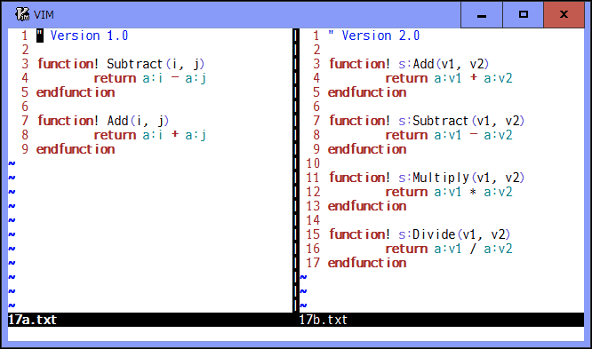
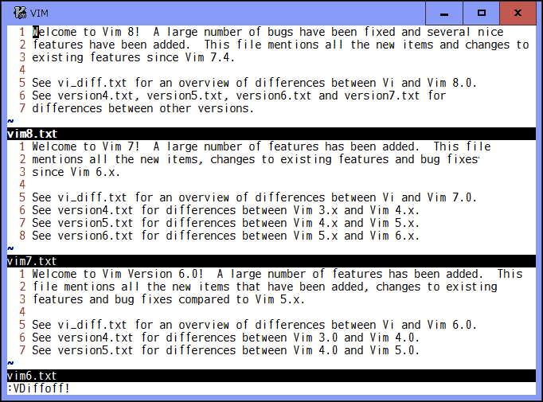

# spotdiff.vim

## A range and area selectable diffthis to compare partially

### Introduction

Vim provides diff mode which is useful to see differences between windows.
However, it always shows the differences for entire line. And can not compare
a sequence of words within a line, and sentences and paragraphs which are
separated into several lines.

To compare partially everywhere in windows, this plugin provides two groups of
commands, which are alternative to vim original `:diffthis`, `:diffoff`, and
`:diffupdate`. One is for which allows to select a range of lines to be
compared in diff mode. Another is for which allows to select the Visual area
to be compared in non-diff normal mode. Both work independently in a tab page.

Do not use vim original diff commands together with this plugin's ones to
prevent any errors and troubles.

It is recommended to install **diffchar.vim** plugin
(https://github.com/rickhowe/diffchar.vim) so that you can see the exact
differences.

### Selecting a range of lines

There are `:Diffthis`, `:Diffoff`, and `:Diffupdate` commands available.

* `:[range]Diffthis`
  * Select a range of lines with `[range]` and make the current window diff
    mode. If `[range]` is not specified, the current line will be selected.
    The selected lines are highlighted in `hl-CursorColumn`. When two
    separate windows become diff mode, `:Diffthis` shows the differences
    for selected lines in each window. It is possible to select two ranges
    of lines in the same window. `:Diffthis` opens a temporary new window
    above or below of the current one, copies selected lines to it, and
    shows the difference with source window.

* `:Diffoff[!]`
  * Clear the selected range of lines and reset diff mode for the current
    window. If `!` flag is specified, clear and reset for all windows in the
    current tab page. The temporary window created by `:Diffthis` will be
    closed when its original window is cleared.

* `:Diffupdate[!]`
  * Update the differences for the selected range of lines. If `!` flag is
    specified, the file is reloaded if necessary.

#### Demo

### Selecting the Visual area

There are `:VDiffthis`, `:VDiffoff`, and `:VDiffupdate` commands available.
Note that they work in non-diff normal mode.

* `:[range]VDiffthis[!]`
  * Select the last characterwise, linewise, or blockwise Visual area in
    the current window. If `[range]` is different from the last Visual area,
    it is selected as linewise Visual area. The selected area is
    highlighted in `hl-DiffChange` with "italic", and then will be
    compared as a single combined line. But if `!` flag is specified, each
    line is separately compared, which would be useful particular for
    columns in a table on blockwise area. Redundant lines in the
    line-by-line comparison are shown with "strikethrough". Shortly after
    the two area are selected, `:VDiffthis` compares them based on the
    `g:DiffUnit` option and "icase", "iwhite", "iwhiteall" and "iwhiteeol"
    flags in the 'diffopt' option. Then their differences are shown using
    the `g:DiffColors` option. It is possible to select two Visual area in
    the same window.

    * `g:DiffUnit`, `t:DiffUnit` - A type of difference unit
      * 'Char'   : any single character
      * 'Word1'  : \w\\+ word and any \W single character (default)
      * 'Word2'  : non-space and space words
      * 'Word3'  : \\< or \\> character class boundaries

    * `g:DiffColors`, `t:DiffColors` - Matching colors for changed units (`hl-DiffAdd` for added units)
      * 0   : `hl-DiffText` (default)
      * 1   : `hl-DiffText` + up to 3 other highlights
      * 2   : `hl-DiffText` + up to 7 other highlights
      * 3   : `hl-DiffText` + up to 15 other highlights

* `:VDiffoff[!]`
  * Clear the selected area in the current window and reset its
    differences. If `!` flag is specified, clear and reset all area in the
    current tab page.

* `:VDiffupdate`
  * Compare the selected area again and show their differences in the
    current tab page, when you make changes to the selected area or you
    want to change `g:DiffUnit` or `g:DiffColors` option.

#### Demo

